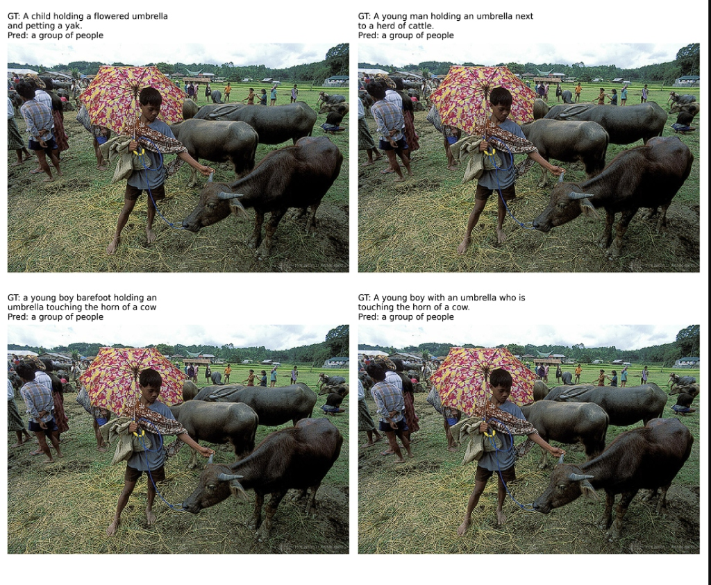

# Stage 1: Zero-Shot Baseline Evaluation

This branch (`zero-shot-baseline`) contains the initial exploratory experiment for our Vision-Language Model Image Captioning project. 

Our goal is to establish a **Zero-Shot Baseline**. We want to understand how the foundational `Salesforce/blip-image-captioning-base` model performs on the COCO dataset "out-of-the-box," before we apply any task-specific fine-tuning or LoRA adaptations.

---

## 🏗️ Architecture Overview (Zero-Shot)

To maintain a professional, scalable MLOps environment, the code in this branch is strictly modularized into three layers:

1. **Data Layer (`src/dataset.py`)**: 
   - Responsible solely for data acquisition and formatting.
   - We utilize the Hugging Face `datasets` library to securely pull the `HuggingFaceM4/COCO` validation split.
   - Images are validated and converted to strict RGB format to prevent tensor dimension crashes during inference.
2. **Model Layer (`src/model.py`)**: 
   - Responsible for downloading and instantiating the 248M parameter BLIP architecture.
   - For this specific branch, the model is loaded in pure evaluation mode (`use_lora=False`).
3. **Execution Layer (`src/evaluate.py`)**: 
   - The conductor script. It bridges the Data and Model layers.
   - Passes batches of images through the BLIP model to generate raw textual predictions.
   - Uses `matplotlib` to generate a 2x2 grid visualizing the Image, the Ground Truth (GT), and the Model Prediction side-by-side.

---

## 📊 Dataset Nuances: The "Multiple Ground Truths" Phenomenon

During evaluation, we observed a fascinating dataset structure characteristic of high-quality ML benchmarks.

**The Observation:** Our evaluation grid plotted the exact same image four times in a row. However, each instance had a slightly different Ground Truth caption (e.g., *"A child holding a flowered umbrella and petting a yak"* vs. *"A young man holding an umbrella next to a herd of cattle"*).

**The Explanation (Dataset Unrolling):** 
Because human language is subjective, the creators of the COCO dataset paid 5 different human annotators to describe every single image. When Hugging Face packaged this dataset, they "unrolled" it. Instead of one row containing one image and an array of 5 captions, they created 5 distinct dataset rows per image. 

Therefore, our pipeline correctly processes the same image multiple times, each paired with a valid, alternative human perspective.

---

## 🧠 Model Inference and Identified Issues

By running the zero-shot baseline, we identified critical flaws in the foundational model's ability to interpret specific complex scenes.

1. **Hallucination and Counting Failures:** 
   - In our visualization grid, an image clearly depicting a single boy and cattle was repeatedly captioned by the model as **"a group of people"**. 
   - The model completely hallucinated the presence of a group, demonstrating a failure in basic object counting and relationship understanding.
2. **Deterministic Generation:**
   - Because the AI generation is completely blind to the Ground Truth text, feeding the model the exact same image pixels (due to the unrolled dataset) resulted in the exact same deterministic output ("a group of people") every single time, regardless of the varying Ground Truths.

## 🎯 Conclusion & Next Steps

**The Zero-Shot model is insufficient.** While BLIP understands basic visual concepts, it lacks the domain-specific nuance and accuracy required for high-quality COCO captioning. It struggles with scene composition and object relationships.

**Transition to Stage 2:** 
To fix these hallucination and counting issues, we must teach the model the specific linguistic and visual style of the COCO dataset. 

Instead of retraining all 248 Million parameters (which is computationally impossible on our limited Kaggle GPUs), we will move to the `main` branch to implement **Low-Rank Adaptation (LoRA)**. This will allow us to inject and train a tiny subset of "adapter" weights (~1.1 Million parameters) to drastically improve the model's performance while maintaining a tiny memory footprint.
