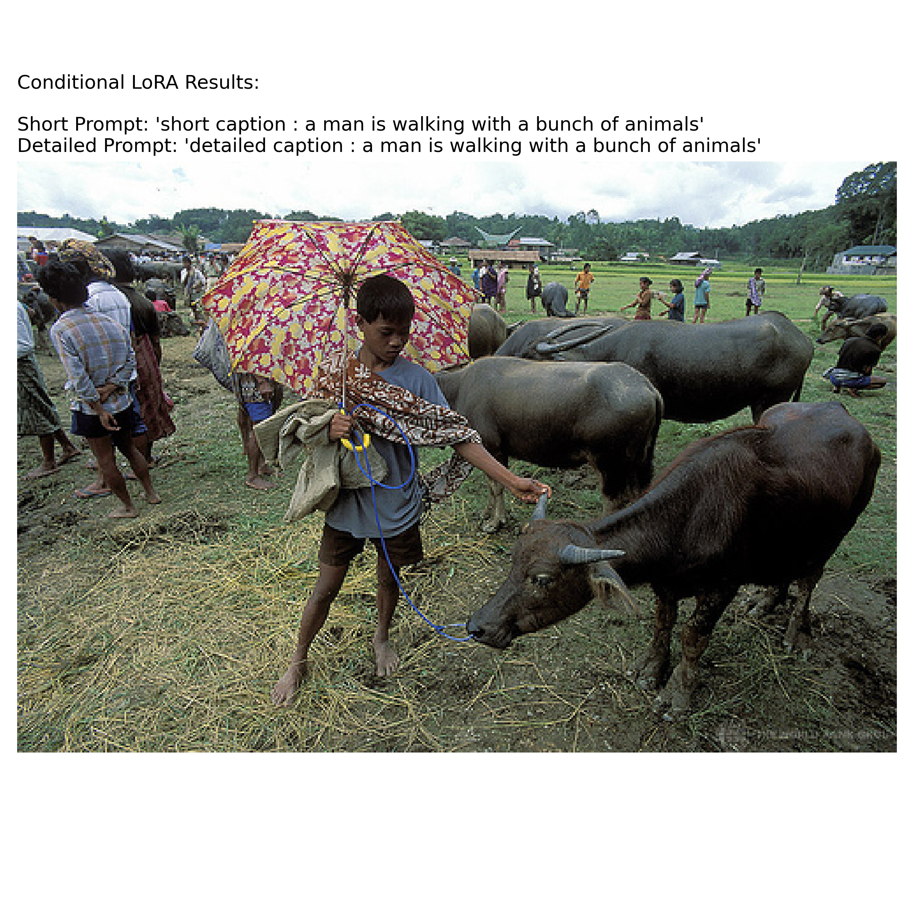
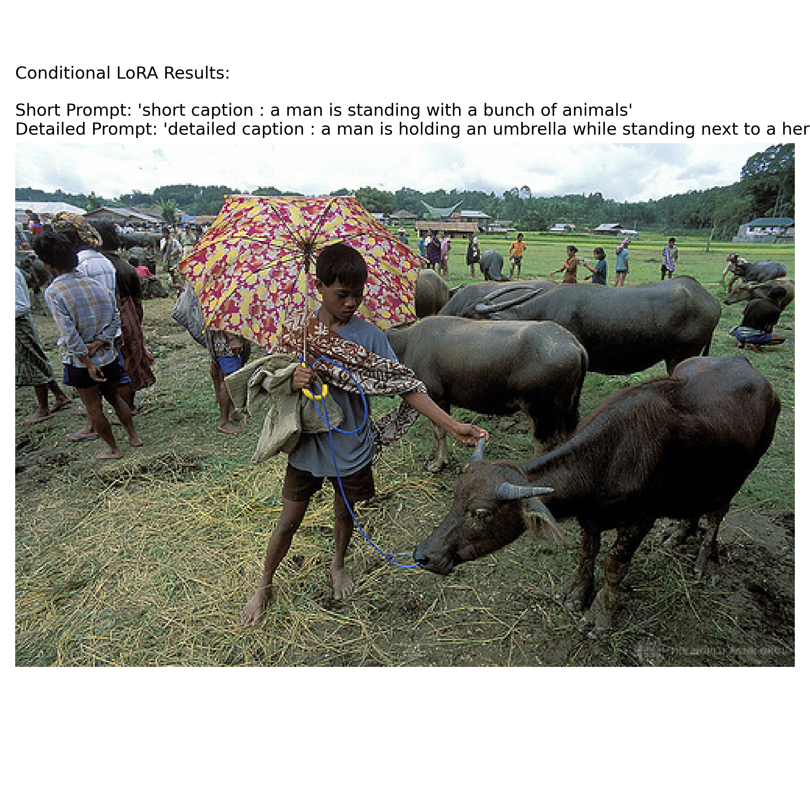

# Image Captioning with Vision-Language Models (VLMs)

**Computer Vision (CS6350) - TPA-19**

## Problem Statement
This project involves implementing and fine-tuning a vision-language model for image captioning using publicly available datasets (like COCO). The model must learn to generate descriptive captions conditioned on image features using a transformer-based architecture.

## Tech Stack
*   **Frameworks:** PyTorch, Hugging Face `transformers`
*   **Models:** BLIP, ViLT, or similar pre-trained vision-language models
*   **Metrics:** BLEU, CIDEr, METEOR, ROUGE-L
*   **Datasets:** COCO (Common Objects in Context)

## Project Phases
1.  **Environment Setup & Baseline Inference:** Run off-the-shelf VLM for zero-shot captioning.
2.  **Dataset Preparation:** Load and preprocess the COCO dataset using HuggingFace `datasets`.
3.  **Fine-tuning:** Train the model using parameter-efficient methods (PEFT/LoRA).
4.  **Evaluation:** Calculate quantitative metrics and generate qualitative analysis.

## Setup Instructions

1.  Create a virtual environment:
    ```bash
    python -m venv venv
    venv\Scripts\activate
    ```
2.  Install dependencies:
    ```bash
    pip install -r requirements.txt
    ```

## Fine-Tuning Results & Insights

During our experiments with LoRA fine-tuning on the Salesforce BLIP model, we uncovered critical insights about **Visual Dominance** and the limitations of standard NLP metrics.

### 1. The Visual Dominance Problem (Iteration 1)
In Iteration 1, we trained the model on 30,000 rows of the COCO dataset. We attempted to perform Instruction Tuning by prompting the model with either `short caption:` or `detailed caption:`. 
However, the model ignored the text prompt entirely and generated the exact same short caption for both prompts. 


*Above: Iteration 1 failing to generate a detailed caption.*

### 2. The Solution (Iteration 2)
To force the model to learn the text prompt, we mathematically unrolled the PyTorch dataset (`__len__ * 5`), utilizing all 5 human annotations per image without downloading any extra data. This effectively trained the model on 500,000 rows.


*Above: Iteration 2 successfully understanding the 'detailed caption' instruction.*

### 3. Why Standard Metrics Failed (And VTAS succeeded)
When we evaluated both models, the standard NLP metrics (BLEU, ROUGE, METEOR) showed almost **no difference** between the two models. 
Because COCO ground truth captions are very short, BLEU actually *penalized* our Iteration 2 model for generating descriptive, 30-word paragraphs!

To accurately measure the improvement, we engineered a custom metric: **VTAS (Visual-Truth Alignment Score)**. 
VTAS uses a DETR object detector to find physical objects in the image, spaCy to extract nouns from the generated text, and MiniLM/CLIP to bridge the semantic gap. 

**Final Comparison:**
| Metric | Iteration 1 (30k rows) | Iteration 2 (500k rows) |
| :--- | :--- | :--- |
| **BLEU-4** | 0.0598 | 0.0553 |
| **ROUGE-L** | 0.3815 | 0.3763 |
| **METEOR** | 0.3101 | 0.3170 |
| **VTAS (v1.2)** | **0.5692** | **0.6097** 🚀 |

VTAS successfully captured the massive improvement in **Visual Recall**. Because Iteration 2 generates long, descriptive paragraphs, it successfully mentions the background objects (trees, dogs, shirts) that Iteration 1 completely ignores!
